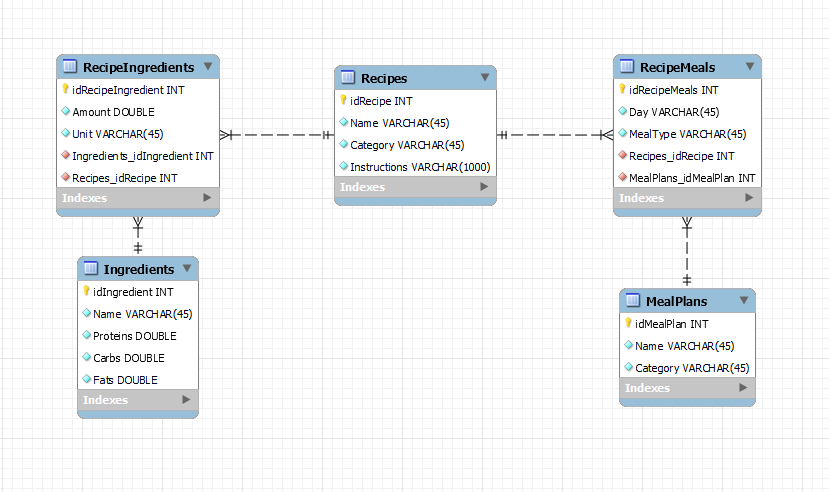
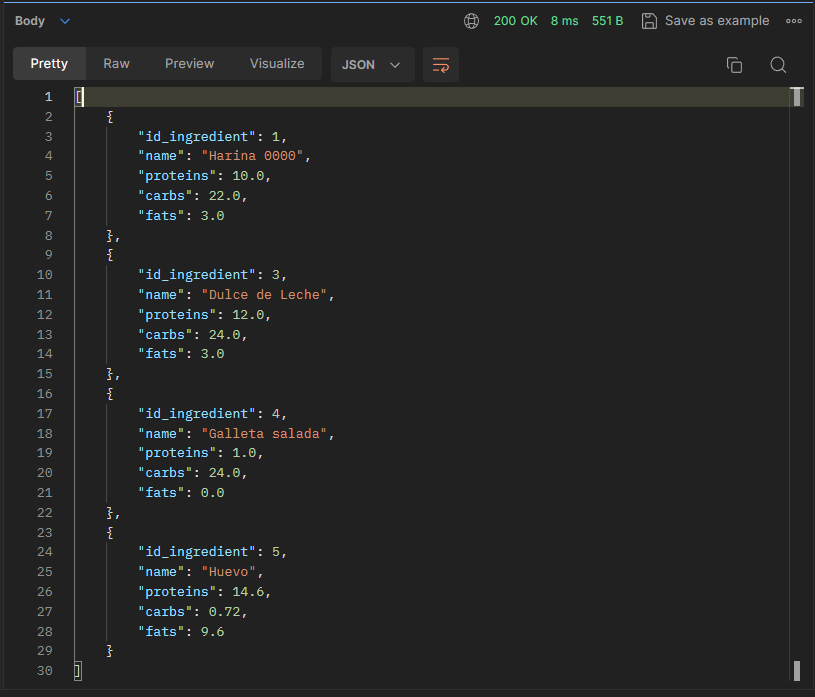
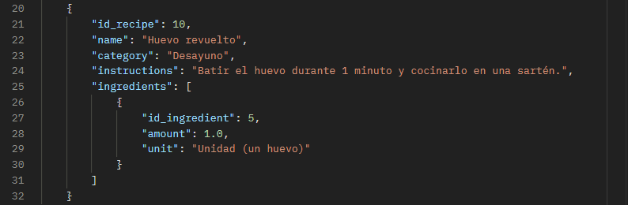
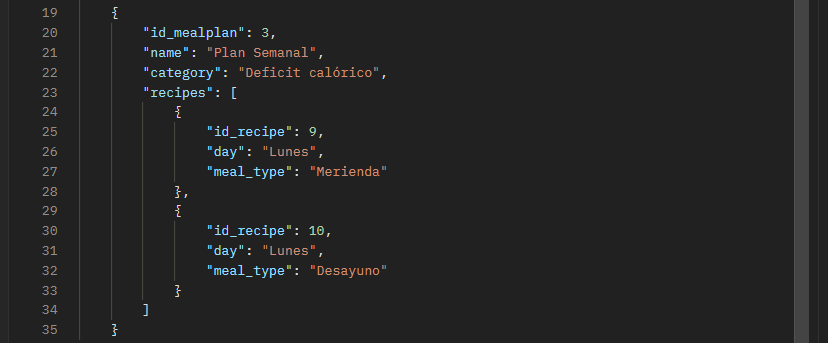

# REST API for a Meal Plan in Rust Language using Rocket Framework.

## Date - 2023

> [!NOTE]
> Due to time constraints, simplifications were made in the database, intuitive messages for users and logs. Please note that this is a learning-oriented application.

### Authors:
- **Robledo, Valentín**
- **Bottini, Franco**
 
Github users: valentinrb1, francobottini99

## Abstract

In this project, a API REST was developed for a meal plan using the Rocket framework. The "*backend*" consists of managing a database that allows storing ingredients, recipes and meal plans.

It was done in *Rust* language.

## How to clone this repository?
You can clone this repository to any directory you want using the following command:

```console
git clone https://github.com/valentinrb1/rust-api-rest-rocket.git
```

## How to use?

First, in order to test the program we will have to start a *MySql Server* service. The database schema is located in the **[database](./database/)** directory of the project.

Then, configure the **[database.env](./server/database.env)** file with the *mysql* address to be able to establish a connection with the database.

Once the database is configured we can run the server, go to the main directory of the **[server](./server/)** project and use the following commands:

```console
cargo build
```

```console
cargo run
```

Once the server is running we can use the *endpoints*. In our case we use the *postman* software.

## Endpoints

### Ingredients 

- <span style="color: green">POST</span> `/api/add/ingredient`: Add an ingredient.
- <span style="color: dodgerblue">GET</span> `/api/get/ingredient`: Get ingredients.
- <span style="color: gold">PUT</span> `/api/update/ingredient`: Update ingredients.
- <span style="color: red">DELETE</span> `/api/delete/ingredient/<id>`: Delete an ingredient by ID.

### Recipes 

- <span style="color: green">POST</span> `/api/add/recipe`: Add a recipe.
- <span style="color: dodgerblue">GET</span> `/api/get/recipe`: Get recipes.
- <span style="color: gold">PUT</span> `/api/update/recipe`: Update recipe.
- <span style="color: red">DELETE</span> `/api/delete/ recipe/<id>`: Delete a recipe by ID.

### Meal Plans

- <span style="color: green">POST</span> `/api/add/mealplan`: Add a meal plan.
- <span style="color: dodgerblue">GET</span> `/api/get/mealplan`: Get meal plans.
- <span style="color: gold">PUT</span> `/api/update/mealplan `: Update a meal plan.
- <span style="color: red">DELETE</span> `/api/delete/mealplan/<id>`: Delete a meal plan by ID.

### What does each *request* get?

### Ingredients

> [!NOTE]
> Simplification for ingredient nutritional value data: values ​​are loaded per 100g.

```json
{
    "id_ingredient": 0,
    "name": "String",
    "proteins": double,
    "carbs": double,
    "fats": double
}
```

### Recipes

> [!NOTE]
> The *id* of each ingredient is provided with the quantity and the unit that describes that quantity.

```json
{
    "id_recipe": 0,
    "name": "String",
    "category": "String",
    "instructions": "String",
    "ingredients": [
    {
      "id_ingredient": 0,
      "amount": double,
      "unit": "String"
    },
    {
      "id_ingredient": 0,
      "amount": double,
      "unit": "String"
    }
    {
        "..."
    }
  ]
}
```

### Meal Plan

> [!NOTE]
> The *id* of each recipe is provided, specifying the day of the week and the meal of the day it belongs to (breakfast, lunch, dinner)

```json
{
    "id_mealplan": 0,
    "name": "String",
    "category": "String",
    "recipes": [
    {
      "id_recipe": 0,
      "day": "String",
      "meal_type": "String"
    },
    {
      "id_recipe": 0,
      "day": "String",
      "meal_type": "String"
    }
  ]
}
```

## Project Architecture

A three-layer architecture was used for the design. It consists of a presentation layer or API, a business layer, and finally a data access layer.

### *API Layer* or *Presentation Layer*

The Presentation Layer or *Presentation Layer* is the interface that exposes the endpoints to the client. This layer is responsible for receiving requests, performing input data validation, and serializing and deserializing data to *json* format so that it is understandable to the client.

### *Business Layer*

The Business Layer or *Business Layer* is responsible for the application logic. Business rules, processing logic, and complex operations that should not be directly in the presentation layer are implemented here. This layer acts as a bridge between the API layer and the data access layer, ensuring that the application works according to the rules.

### *Data Access Layer*

The Data Access Layer interacts directly with the database. It is responsible for performing read and write operations on the database based on requests from the business layer. SQL queries and data manipulation are handled here, ensuring that information is stored and retrieved efficiently and securely.

## Database



## Some basic examples

> [!NOTE]
> The examples were done in Spanish.

### *POST ADD* y *GET* to Ingredients

```console
/api/add/ingredient
```
```json
{
    "id_ingredient": 0,
    "name": "Huevo",
    "proteins": 14.6,
    "carbs": 0.72,
    "fats": 9.6
}
```
---
```console
/api/get/ingredient
```


### *POST ADD* y *GET* to Recipes

```console
/api/add/recipe
```
```json
{
    "id_recipe": 0,
    "name": "Huevo revuelto",
    "category": "Desayuno",
    "instructions": "Batir el huevo durante 1 minuto y cocinarlo en una sartén.",
    "ingredients": [
    {
      "id_ingredient": 5,
      "amount": 1,
      "unit": "Unidad (un huevo)"
    }
  ]
}
```
---
```console
/api/get/recipe
```


### *POST ADD* y *GET* to Meal Plan

```console
/api/add/mealplan
```
```json
{
    "id_mealplan": 0,
    "name": "Plan Semanal",
    "category": "Deficit calórico",
    "recipes": [
    {
      "id_recipe": 9,
      "day": "Lunes",
      "meal_type": "Merienda"
    },
    {
      "id_recipe": 10,
      "day": "Lunes",
      "meal_type": "Desayuno"
    }
  ]
}
```
---
```console
/api/get/mealplan
```


